# iOS App 開發入門

這是一個針對 iOS 開發的入門課程。目標教授如何利用 Xcode 開發環境及 iOS 的開發 SDK 及各種 API 來開發移動應用程式。最後將程應發佈到 App Store 上架。

# About me: Makzan

我自細撰寫開發不同的網頁系統，Facebook推出之初，我開始你用Facebook平台撰寫社交遊戲及 Flash 遊戲。亦有開發大型線上多人即時遊戲。

自 2010 年推出 iPad 起，投入開發 iOS 遊戲及應用程式。在 iPad 2010 年3月尾首發當天，我的第一隻iPad遊戲就在App Store上被一群群剛剛拿着iPad上App Store 尋找好用 app 的用戶下載。

過往開發亮點：

-   Fish Ball game
-   Chicken Rain app
-   音樂 app
-   Music Player app
-   AR app
-   Unity games
-   Multiplayers game


你可以從以下途徑找到我：

-   網站：[https://makzan.net](https://makzan.net)
-   Github：[https://github.com/makzan](https://github.com/makzan)
-   推特：[https://twitter.com/makzan](https://twitter.com/makzan)
-   FB：[https://fb.com/makzan](https://fb.com/makzan)

# App 類型介紹

我們來看看 App Store 上常見的有哪些類型應用。


1.  社交類
2.  工具類
3.  資訊性
4.  相機類
5.  數碼媒體類
6.  遊戲類

# 遊戲類

以前的遊戲類多使用不同的第三方 Framework，例如 cocos2d，再配搭物理模擬引撃如 Box2D。但然而，從 Apple 推出了 SpriteKit 後，便可以直接在 Xcode 中製作遊戲了。當然，像 Unity 這種大型遊戲引撃仍然是很受歡迎的，例如 Alto's Adventure 就是用 Unity 來撰寫的 2D 遊戲。


# 工具類應用

通常針對特定或單一功能需求外設計，其特點是所針對的功能往往能提供很優秀的解決方案。 例如針對不同情況的計算機、文字編輯器等。


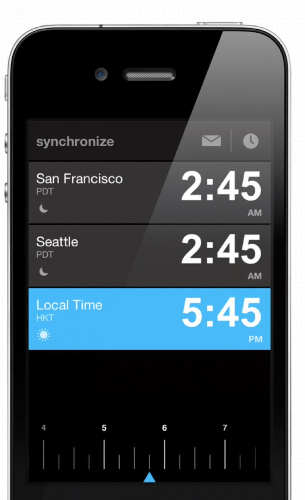


不同情況的計算機，可以有專門計折扣的、專門計算AA制的、專門計算不同單位換算的、專門計算某特定公式的等等。


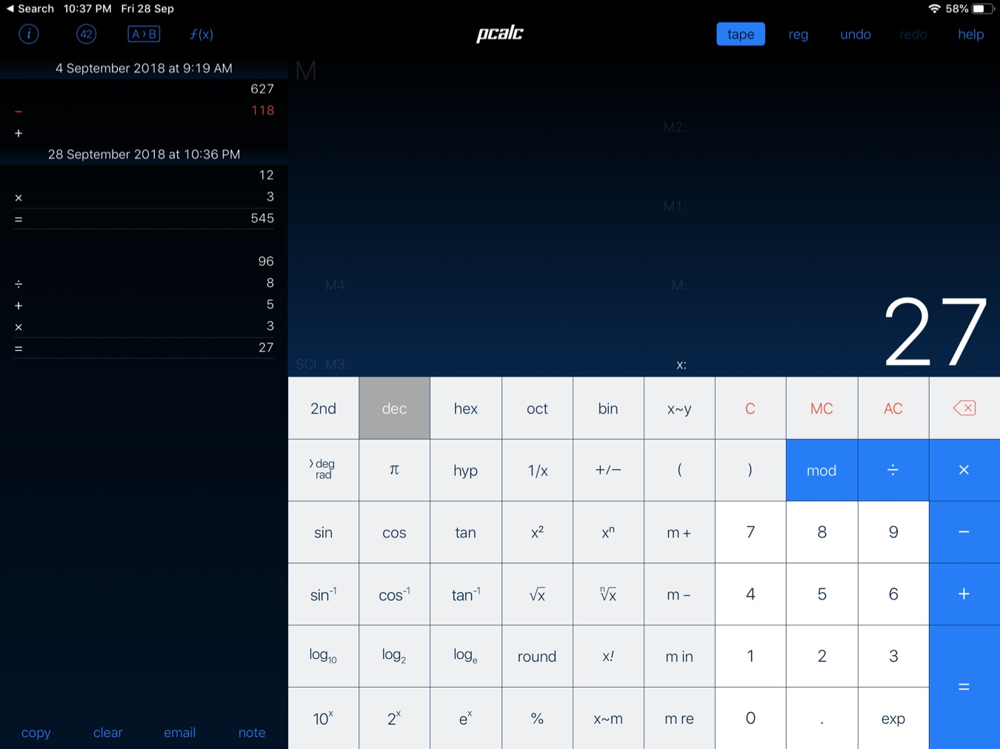


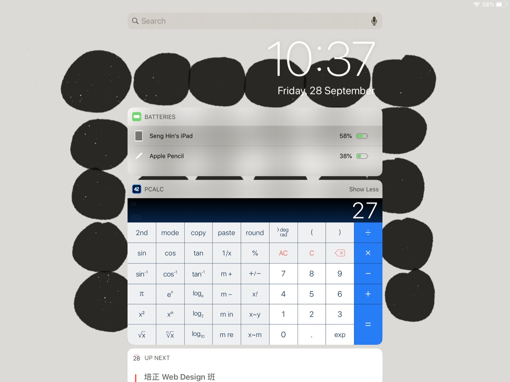

# 攝影類 App

攝影是其中一個大分類。 

自 iOS 剛推出以來，第三方攝影 App 一直有捧場客。 

例如以晚上影相穩定主打的、有影相後加貼紙的、有多重曝光的、有專門影正方形的、有專門影 360 環迴全景的、有手動控制的、有影 Raw 檔的、有自動人臉美化的、有前後鏡頭一起用的，等等，數之不盡。


# 社交類型應用

社交應用不一定是大型的 Facebook，也可以是針對特定群中，例如 Tumblr 這種多媒體個人日誌、知乎這種有問有答社區、Path 這種有朋友上下的好友分享，也有只針對家庭甚至情侶的小眾社交應用，只要能夠成功針對特定社群的需求，其功能往往會比普通的大型社交網絡更加實用。


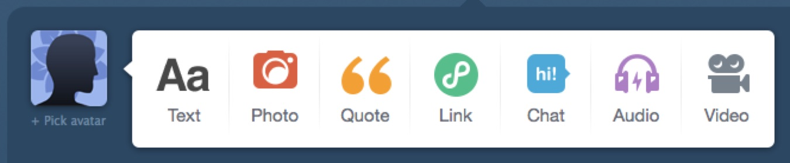

# 電子多媒體類

即是電子雜誌。

最基本的是靜態將 PDF 直接呈現，更深入的有重新為手提設備排版的，甚至為手提設備加入多媒體互動的。

例如專門針對手機上的純文字由上向下閱讀文章功能。

例如針對 iPad 的多媒體互動設計雜誌。

甚至電子雜誌商城。

# 資訊性app

當我們有一些資訊需要情的時候，例如交通事務局的停車場、巴士路線、巴士報站、路面視頻等等，又例如天氣、民生、電影資訊等等，都屬於資訊性app。 

這些 App 的特點是根據資訊的內容設計實用美觀的閱讀體驗，並且通過良好的導航及分類讓使用者方便瀏覽訊息。


# 觀察

要寫好 iOS app，其中一個重要步驟是觀察。

通過觀察其他人使用電話上的不便，通過觀察蘋果推出的新 API，通過觀察蘋果新輸入方式，通過觀察日常生活方式，然後想出嶄新的應用方式、嶄新的功能、嶄新的 API 組合、嶄新的服務。

新 API，可以為原本不能做的事情變成可做，可以為原本做不好的事情變得更完善。例如 GeoFence 推出使我們可以在地圖上劃定不同的圓，當電話進入或離開時系統便會通知我們的應用程式。又例如某新版 iOS 加入了手動控制鏡頭功能，於是相機 App 都可以手動控制快門及 ISO。


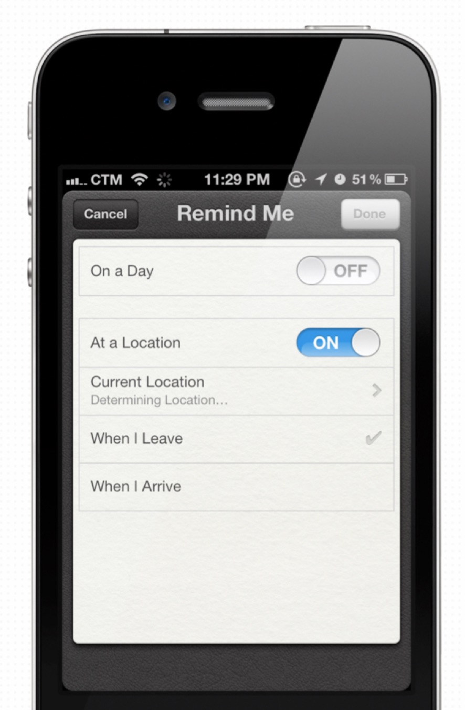


新輸入方式，往往會是新電話或新潮流的徴兆。例如推出更多手勢功能，例如鍵盤可以兩隻手指變成 Trackpad 等。 通過觀察，可以比其他人走先一步；通過觀察，可以比其他人更了解 API 背後的原意。當你能夠在不同 API 之間創出別人沒有的組合時，你便造出了一個獨一無二的應用程式。

# iOS 開發的歷史


iPhone 在 2007 年推出，當時是沒有針對 iPhone 系統的開發工具開放的。Xcode 已經有，但仍然是給開發 Mac 機上的軟件而。2007 年第一代 iPhone，主打的是開發者可以開發 Web App 網頁程序。


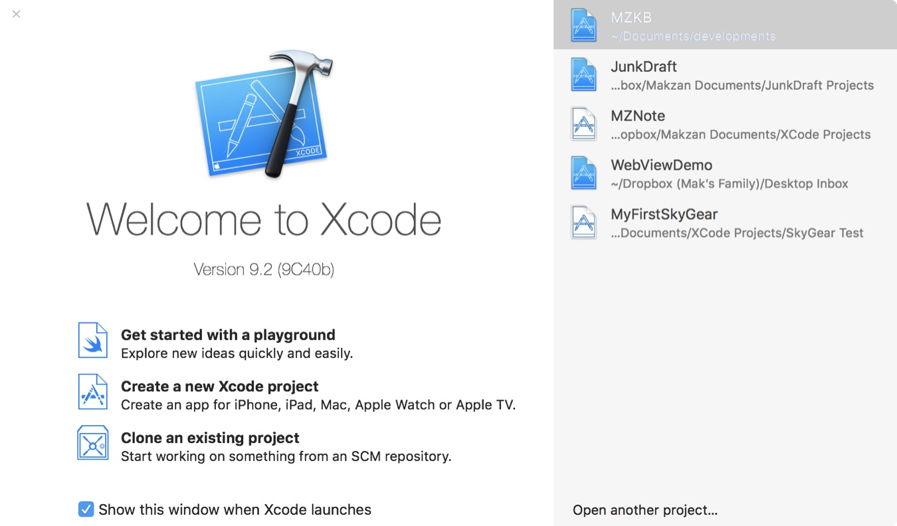


可惜，經過 2007 年推出以來約一年的 Web app 開發，大家還是渴求得到運用 iPhone 硬件及系統的原生（Native）軟件開發工具。於是，在 2008 年三月，蘋果公佈了基於 Xcode 及 iOS 2 的開發套件。自次，我們的生活便再離不開手機應用了。

# iOS 系統背景

iOS 的底層是 Mac OS X 的 Darwin Unix 系統，蘋果在上方增加了專門為 Touch 而設計的 UIKit。而其他例如數據類型則繼續和 Mac OS X 共用，例如 NSData, NSArray, NSString, NSDictionary 等。

蘋果系統的 Class 是使用 Prefix 來做 Namespacing 的，例如專門給 iOS 用的界面就是 UI 字開頭，如 UIView, UILabel, UIButton 等。遊戲用的 SpriteKit 就有 SKView, SKScene, SKNode 等。位置相關的 CoreLocation 就有 CLLocationManager 等。

而數據類型 NSData, NSArray 等，其 NS 則是遺傳自 Mac OS X 的前身：NextStep 電腦。而在蘋果推行 Swift 之際，亦在努力令系統去 NS 化，例如推出 Swift 專用的 Array, Dictionary, String, Data 等。

# Xcode 介面介紹

Xcode一打開會令人覺得太多 panel 太多功能，一時可能無所適從。但其實只需要掌握左中右最基本的功能便可以開始 iOS 編程。

左邊 panel 細看有不同的 Tab，但只需要先集中使用第一個檔案 Tab，這𥚃是我們轉換檔案時需要的。一個應用程式會分為很多不同的檔案，每一個分別負責一項功能，所以我們將會經常於不同檔案之間切換。

中間是主要編輯區域，無論是界面編輯還是程序編程，都主要集中在中間區域。

中間區域有時可以分為左右兩邊，例如需要將界面元件與程序連接時，便須要在這個左右分屏編輯器進行。又或者兩段化碼的 git diff 對比亦會需要左右兩個畫面。

右邊 panel 細看亦有不同 Tab。這個 Panel 我們會在幾個常用 Tab 之間切換。

第一個 Tab 是最不常用的，是檔案屬性。當要做多語言 Localization 後便需要在這個 Tab 中設定。

之後就視乎檔案類型，例如界面，我們便會使用尺寸 Tab、界面屬性 Tab 等等。


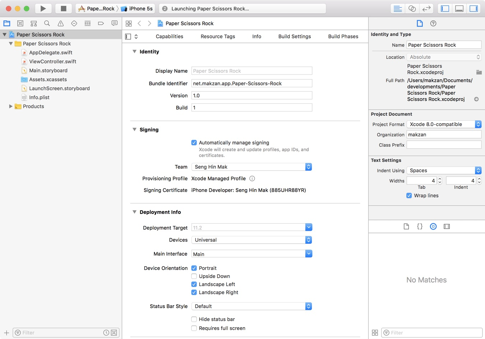


在 Xcode 中，界面主要分為四部份，上方狀態列，左方檔案列表，中間主要編輯器，右方設定面板（Panel）。右上角可以打開及收起左右兩個面板（Panel）。另外還可以打開打開下方的輔助輸出框。如果運行期間有除錯信息需要查看，可以在這個輸出框中查找。


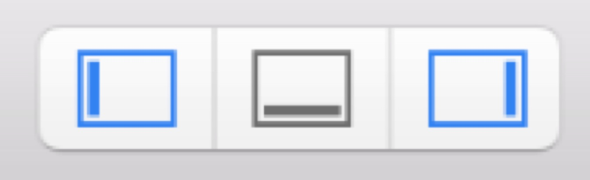


# 製作 iOS 應用，須要什麼工具？

首先，我們需要一台 **Mac** 機，可以是 Macbook / iMac / Mac mini，總之就是要一個可以運行 macOS 的蘋果機。


然後，我們需要下載 **Xcode**，Xcode 是蘋果的開發工具。無論是 Mac 機上的桌面軟件、iOS 的手機應用、iPad 平板應用、Apple Watch 程序，還是 Apple TV 上的播放器等，都是使用 Xcode 來開發的。Xcode 可以在 Mac 系統上的 App Store 免費下載。


Xcode 會跟隨一個 **iOS Simulator**，方便我們直接在電腦上測試各種屏幕的 iPhone/iPad 設備，從 iPhone 5s 到 iPhone X 都有。當我們要測試自己的應用在大大小小不同屏幕尺寸上的運行情形時，我們就很需要這個模擬器。


再者，如果需要將開發中的 iOS App 放到實體 iPhone/iPad 上運行時，我們使需要一個開發用的 **Apple ID**。以往 iOS 開發最多的投訴就是要付費才可以落機試。一個 Apple Developer 付費帳號需要美金 99 一年，折合約澳門幣 800 㘣，還需要每年續期。但自從 iOS 9 以後，只需要使用免費註冊的 Apple ID，便可以將撰寫中的應用程式，通過 USB Lightening 線直接落機測試。

# 將 Xcode 上的 iOS 專案發佈到 iPhone / iPad 上

以往最常聽到寫 iOS 應用的人投訴，要付出 $99 美金（約 $800 葡幣）才可以在實體電話落機調試。


自從 iOS 9 以後，只要註冊免費 Apple ID 帳號，就可以通過直接 USB 連接手機及 Xcode 暫寫中的應用程式直接放到手機上運行。


[http://help.apple.com/developer-account/#/dev21218dfd6](http://help.apple.com/developer-account/#/dev21218dfd6)


# **如何註冊 Apple ID ?**


一般如果我們已經有 iCloud 或者在 App Store 中下載軟件，都會有自己的 Apple ID，可以使用這個 Apple ID 進行開發。而我過往的習慣，我個人會使用另一個電郵作為開發者的 ID 帳號，因為開發期間不同設定及使用情形，我不想和個人的購買記錄或者個人相片等資料等混在一起。所以，我會使用獨立的電郵地址來申請多一個 Apple ID 專門用於開發帳號。

# 一個項目的檔案

一個項目有不同的檔案，以下簡介其功能：


-   AppDelegate.swift 負責控制檔案的 Life Cycle
-   Info.plist 是應用程式的系統設定，例如於 Home Screen 顯示的名稱、需要的權限及說明文字
-   Main.storyboard 是主要的介面檔案，如果是簡單的應用程式，這個檔案可以包含整個 App 的所有界面
-   LaunchScreen.storyboard 是打開 App 時，未完成載入期間，用戶望到的第一個個畫面。
-   Assets.xcassets 裝著一群群的圖片檔案，例如 App Icon，App Icon 有不同的尺寸以符合不同機種及使用情景。
-   ViewController.swift 是預設 Single View App 的範本檔案，是第一個畫面背後的程序碼。


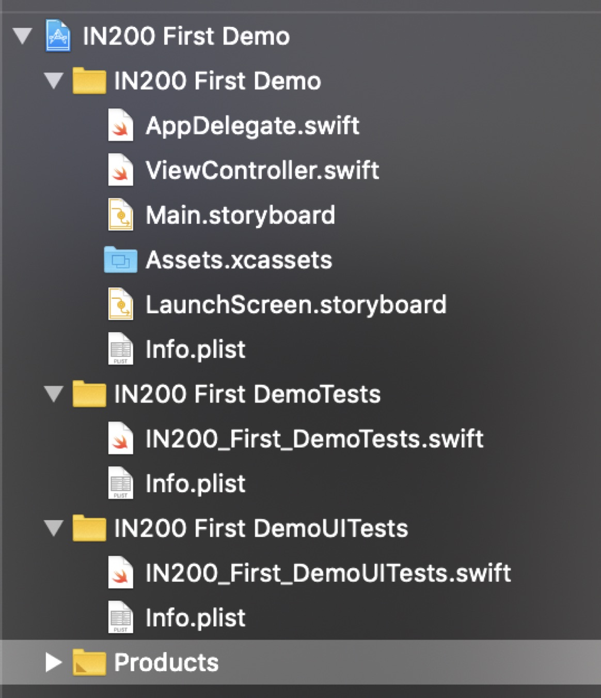

# 開發 iOS App，我應該選擇 Objective-C 還是 Swift 語言？


Objective-C 歷史悠久，自 80 年代後便已面世，並且一直是 Mac 機軟件開發所使用的編程語言，所以 iOS 推出時，也順理成章使用 Objective-C 語言。但 Objective-C 語言其實寫法較為獨特，和傳統的 C / Java 等語言寫法有一定差距，導致除了 Mac 開發外，使用 Objective-C 的人不多。

Objective-C 提倡 Message Passing，即 Call function 是溝通，而不是命令。所以用 Objective-C 寫出來的語句很像在說英文。例如：


```
[gameObject placeAtX: 123 andY: 456];
```


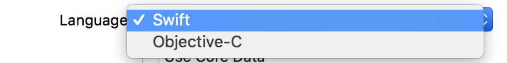


為了更好地推廣編程學習，蘋果便於數年前推出了 [Swift 語言](https://swift.org/)。在經歷多年的使用及調整後，現在 Swift 語言已經趨向穩定成熟，而且網上的新教材基本上都使用 Swift 語言了。


所以，如果現在開始學寫 iOS 應用，直接選擇 Swift 是擁抱未來的好選擇。而 Objective-C，就是過往已寫的代碼，沒有出錯不去改而矣。

# iOS Simulator

在我們落實體機試之前，我們一般會利用 Xcode 跟來的模擬器進行測試。iOS Simulator 模擬器讓我們選擇從 iPhone 5s 至 iPhone X 的不同畫面尺寸，方便測試應用在不同畫面的運行情況。


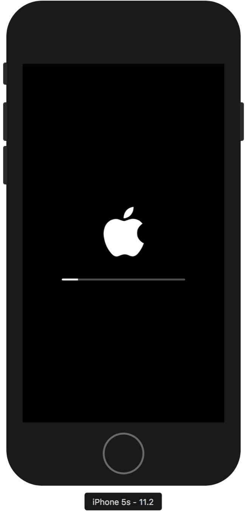

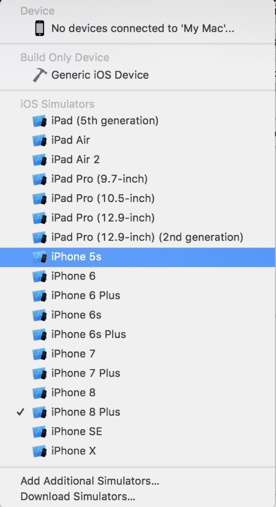

# UIImageView

UIImageView 是用來顯示 UIImage 的界面元素。

預設 UIImageView 只適合顯示本地（Local）的影像數據。UIImageView 顧名思義是顯示 UIImage 的，所以要顯示什麼數據，就主要看 UIImage 的影像數據從哪𥚃獲得。

1.  最直接的方法是使用_影像檔案名稱_，來載入已經儲存到項目內的本地圖像。
2.  另外，就是使用 NSData，想辦法動態生成圖像格式，然後以 UIImageView顯示出來。例如畫板 App 或者填色 App，又或者不同特效的影相 App，都是動態生成圖像的。
3.  從網絡載入圖片，預設的 API 會較為繁複。需要先使用 NSURLConnection 或 NSURLSession 取得網絡數據，再按其返回值（Response）的 header 來說明下載回來的數據所相對應的圖片格式。然後通過 NSData 生成 UIImage。
4.  另一個從網絡載入圖片的快速方法，是使用第三方程序庫，其內部做法跟以上第 3 點一樣，但通常第三方程序庫會提供了一個易用的 API。例如 AlamoFire 會有個 UIImageView extension： \`af\_setImage(withURL:)\`

# Extension

Swift 的 Extension 就要所謂的 Monkey Patch。即對一個已 Compile 的類（Class）再擴展。


Extension 有點類似 Mixin 的概念。其優點是不用再為特定功能而建立 Subclass，因為不同情況下為使用不同功能，未必是 Subclass 可以解決的。


其缺點是如果擴展的函數和原有的函數名稱相同，就會有 Override 出現，並產生同一個函數而行為不一致的問題。所以 AlamoFire 的解決方法是在所有 Extension 上加上 prefix，例如 \`af\_setImage(withURL:)\` 而不是直接使用 \`setImage(withURL:)\`。

# IBAction & IBOutlet

IBAction 和 IBOutlet 是程序和界面的兩種連結。

IBOutlet 是用一程序變量來記錄（reference）一個界面元素，好讓我們在程序中再動態地設定這個界面元素。例如設定一個 UILabel 顯示不同的文字輸出等。


IBAction 是一個函數（function/method），當界面上有互動發生時，例如 UIButton 按下時，需要調用程序的哪一段代碼。

# Storyboard

Storyboard 可以讓我們在一個檔案管理多個關連的介面。這方便我們統一管理這些界面及他們之間的顯示關連。


在使用 Storyboard 以前，我們使用 xib 檔案獨立設定每個畫面。單獨畫面設定的操作其實和 Storyboard 內的畫面設定差不多，Storyboard 多了的是界面之間的連繫。

# UIButton

UIButton 可以讓我們接受用戶互動的各項事件，在介面上拉好 UIButton 後，就可以通過滑鼠右鍵拖拉的方式，拖拉到程序上，建立 IBAction。


另外，UIButton 在設定選項中，可以選擇不同的狀態（State），最常用的狀態，除了平常狀態外，就是 當手指按下時的 Highlight 了。如果於按鈕上使用圖片，也可以在這個 Highlight 狀態設定不同的圖片，做到按下去的效果。


另一種狀態是停用（Disabled），當一個按鈕不想被用戶按下時可以設定為停用。

# UserDefaults

使用方式：

```
// set
UserDefaults.standard.set("anything", forKey: "yourKey")

// get
UserDefaults.standard.value(forKey: "yourKey")
```


UserDefaults 的儲存格式是 plist，作為一個 XML 檔案儲存於 App 的應用 Sandbox 之內。

# Core Data

Keywords：

-   PersistentContainer
-   PersistentStore
-   PersistentStoreCoordinator
-   Entity
-   EntityDescription
-   Context
-   Managed Object

**
Managed Object code generation**

-   Class Definition: 全部 Xcode 管理
-   Category/Extension: 自己定義 NSManagedObject subclass，Xcode 管理 Extension
-   Manual/None: 自己定義 NSManagedObject subclass 及 Extension


自己管理越多，彈性越大，但亦越要自己動手寫。


# **新增記錄**


```
let entity = NSEntityDescription.entity(forEntityName: "Friend", in: persistentContainer.viewContext)

let friend = Friend(entity: entity!, insertInto: persistentContainer.viewContext)
friend.name = "Jack Chan"
friend.tel = "66661234"
self.saveContext()

```


# 搜尋記錄


```
let fetchRequest:NSFetchRequest<Friend> = Friend.fetchRequest()

do {
    let results = try persistentContainer.viewContext.fetch(fetchRequest)
    print(results.count)
    for friend in results {
        print(friend.name)
        print(friend.tel)
    }
} catch {
    print("Fetch error.")
}

```


# 刪除


```
persistentContainer.viewContext.delete(friend)
```

# 保護層級

保護層級

-   NSFileProtectionComplete
-   NSFileProtectionCompleteUnlessOpen
-   NSFileProtectionCompleteUntilFirstUserAuthentication
-   NSFileProtectionNone


More Detail： [https://pspdfkit.com/blog/2017/how-to-use-ios-data-protection/
](https://pspdfkit.com/blog/2017/how-to-use-ios-data-protection/)


Apple iOS Security Guide： [https://www.apple.com/business/docs/iOS\_Security\_Guide.pdf
](https://www.apple.com/business/docs/iOS_Security_Guide.pdf)


# **設定 File Protection Tips:**

1.  Enable File Protection using the Capabilities tab on your app target
2.  If you do not want the default NSFileProtectionComplete, change this setting in the developer portal under your app id
3.  Make sure Xcode has the new provisioning profile this creates.
4.  For protecting files your app creates, that's it.
5.  To protect Core Data, you need to add the NSPersistentStoreFileProtectionKey: NSFileProtectionComplete option to your persistent store.

```
storeDescription.setOption(FileProtectionType.completeUnlessOpen as NSObject, forKey: NSPersistentStoreFileProtectionKey)
            container.persistentStoreDescriptions = [storeDescription]
```

# 設定多語言

**加入語言**


首先選擇項目，然後在 Menu 中選擇 Editor > Add Localization


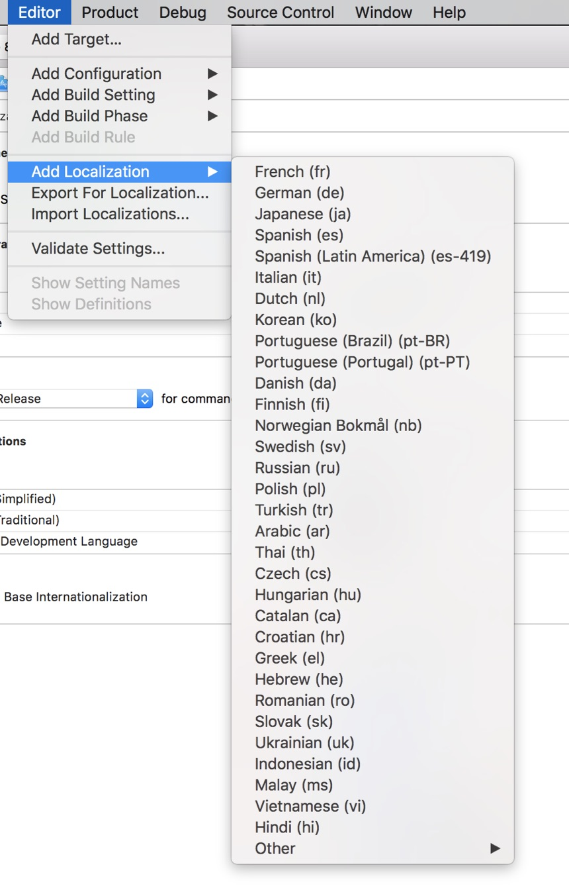


如果已經有 Localized 檔案，Xcode 會詢問基於哪個語言的檔案來建立新語言。

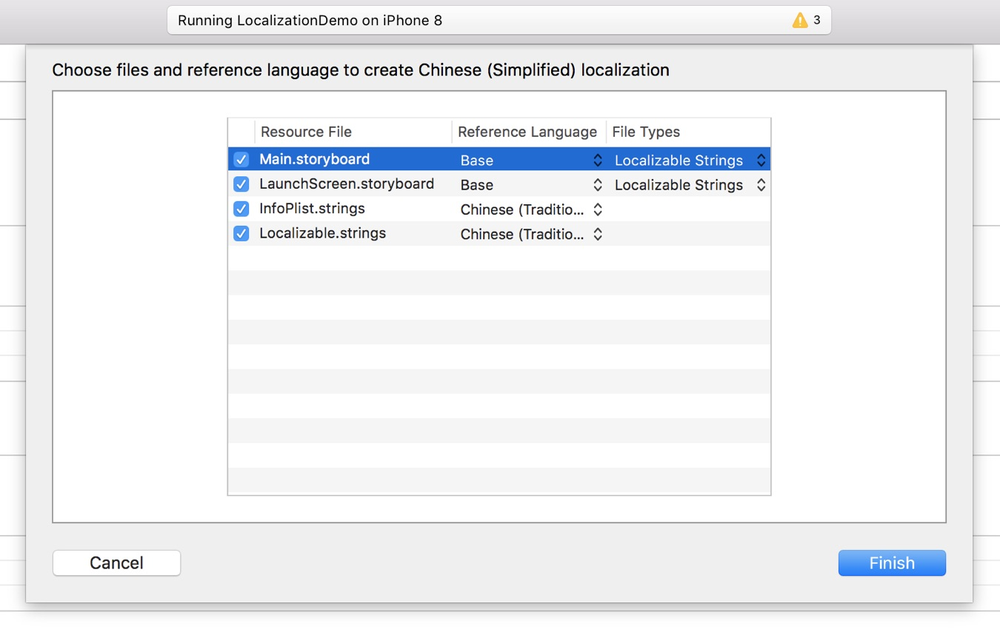


**調試多語言
**

可以在 Scheme > Edit Scheme 中，在運行選項（Run > Options）中選擇要使用哪種語言來運行應用程式。


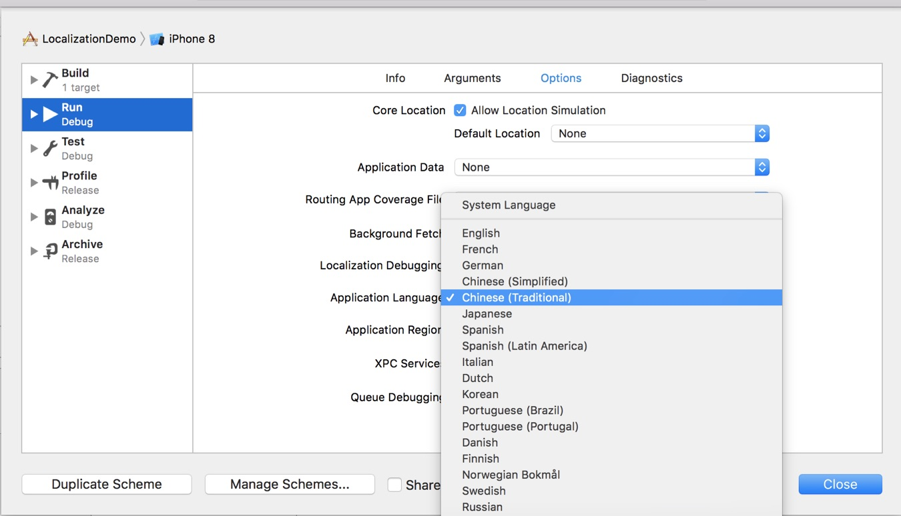


亦可以在 Assistant Editor 中選擇相關多語言設定。


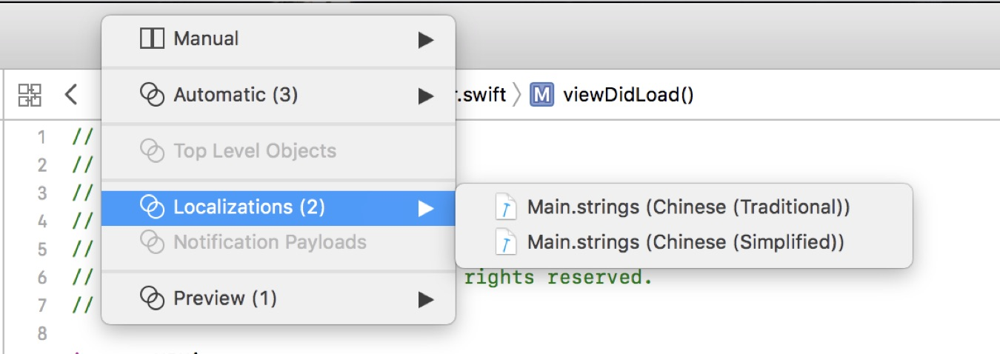

如果選擇 Preview，可以直接在 Xcode Storyboard 中預覽不同語言的介面。


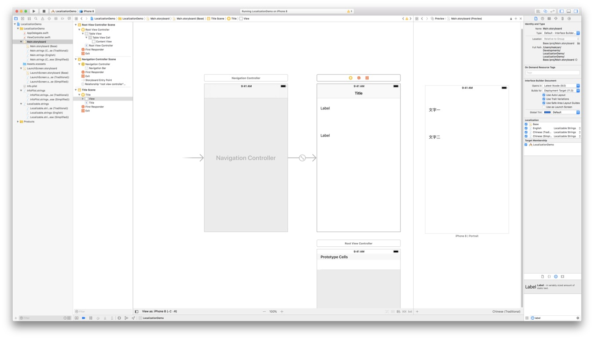


# 圖片的多語言化


在檔案列按下圖片，然後在右方的第一個 Tab 中，選擇 Localize...


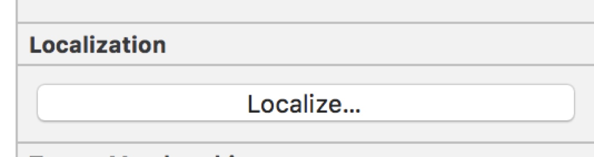

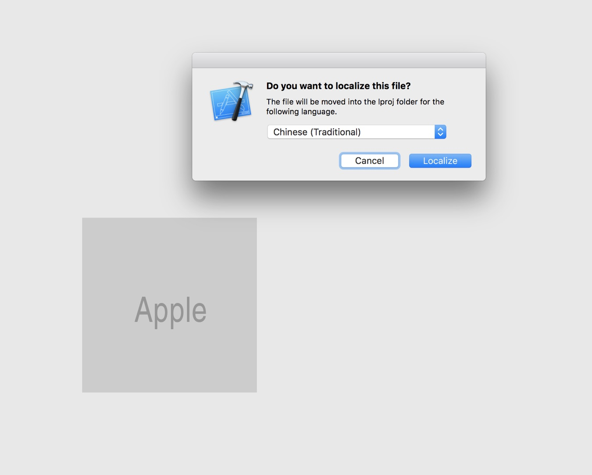

跟接著，替換相關檔案：


並得出最終成品：


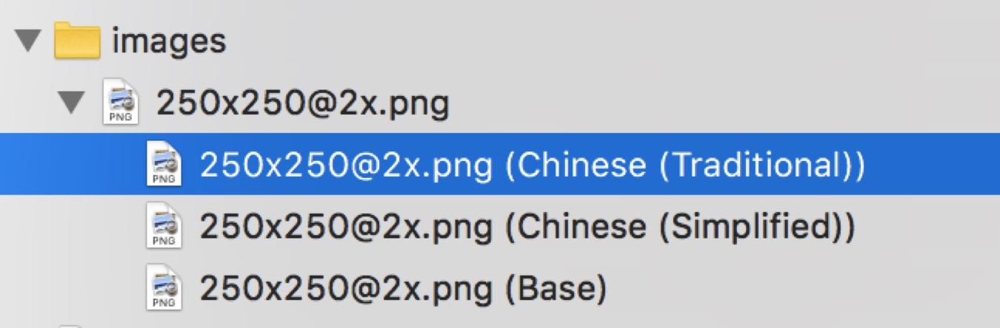

執行結果：


# 多語言下的檔案列表

多語言下的檔案列表


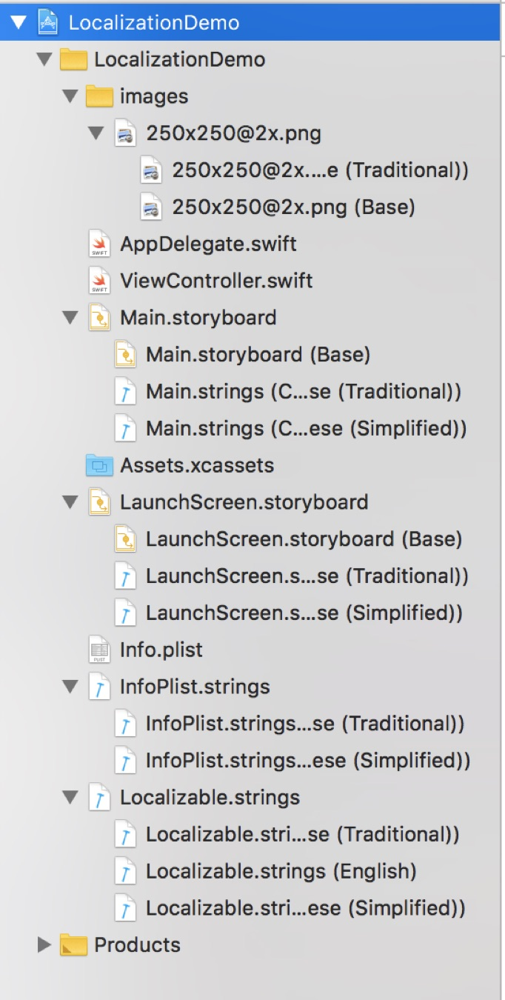

# 輸出及匯入多語言檔案

Xcode 可以讓我們輸出多語言用的 XLIFF 檔案，以方便翻譯者翻譯。


XLIFF 是 XML Localization Interexchange File Format 的意思。


翻譯完成後，我們可以從新匯入，匯入時，如果和原有檔案有 Conflict，Xcode 會彈出比較讓我們審視。


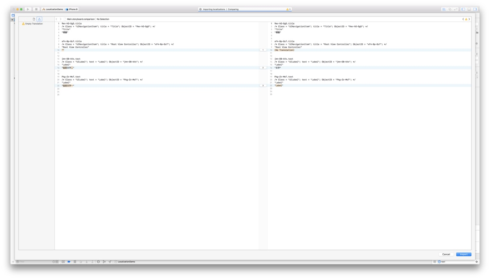


# 如何開啟 XLIFF 檔案？

-   [https://en.wikipedia.org/wiki/XLIFF](https://en.wikipedia.org/wiki/XLIFF)
-   [http://xliff.brightec.co.uk](http://xliff.brightec.co.uk)


# 於 App 內轉換語言


要在 App 內轉換語言，涉及動態地載入不同的 .lproj 檔案。


-   [Stackflow](https://stackoverflow.com/questions/29985614/how-can-i-change-the-localization-programmatically-by-swift)
-   [https://www.factorialcomplexity.com/](https://www.factorialcomplexity.com/blog/2015/01/28/how-to-change-localization-internally-in-your-ios-application.html)
-   [蘋果職員不建議 App 內轉換：](https://forums.developer.apple.com/message/36704#36704)

>
> The system does not support changing your app's localisation on the fly. If you look through the App Frameworks / Localization topic area (which is where I moved your question, btw) you'll find that a significant fraction of the threads are from people having problems when they try to do this. You may be able to work around some of the problems but there are others that have no workaround. Probably the most significant relates to system UI components.
>
>
> If the system puts up a UI component on your behalf (the document picker, or Game Center user interface parts, or whatever) it will do so in the localisation that it thinks that your app is running in. If your app is 'pretending' to run in some other language, you'll end up with a mixed localisation, where some parts of your app (the parts you control) are in one language and other parts of your app (the parts controlled by the OS) are in another. That's a very poor user experience.
>
>
> In my opinion it is much better to avoid this problem entirely by localising your app in the standard way and relying on the system to choose the language for you based on the user's system-wide preferences.
>
>
> — Quinn "The Eskimo!"

# App Store 上架介紹


上架條件：


1.  付費的 Apple Developer Program
2.  於 Developers.apple.com 或 Xcode ，並設定了唯一的 Bundle ID
3.  於 AppStoreConnect (原 iTunesConnect) 上設定了上架所須的資料，並處於 **Ready to Submit** 狀態。
4.  於 Xcode 進行 Project Archive，然後經 Xcode Submit 上 AppStore Connect 並等待審批。

**
選擇正確的 Apple Developer Program
**


Apple Developer Program 有幾種，但我們基本上只會在 _個人_ 及 _公司_ 兩者間選擇。


其餘的 _Enterprise_ 及 _University_ 都不是我們常用的選擇。


**
使用 Test Flight 進行測試
**


[https://developer.apple.com/testflight/](https://developer.apple.com/testflight/)


Test Flight 背後使用了 itms-services 技術。這間公司前身是獨立公司，後來被蘋果收購了。


**
蘋果上架指引
**


[https://developer.apple.com/app-store/review/guidelines/](https://developer.apple.com/app-store/review/guidelines/)


注意：這個指引會不定時更新，所以建議久不久便要重新閱讀一次。

# 使用 AppStoreConnect

首先要認識兩個 Apple 設定後台網址：

1.  developer.apple.com
2.  iTunesConnect.apple.com


注：於 2018 年中，iTunesConnect 已更名為 AppStoreConnect。


Developer 網址是用來設定 App 開發相關資訊的，例如 App Provisioning


而 iTunes Connect 則是設定在 App Store 上面向用戶的資訊。


這個 iTunes Connect，原身是音樂公司於 iTunes 上賣歌的後台設定網站，後來擴展至於 App Store 上發佈應用程式。


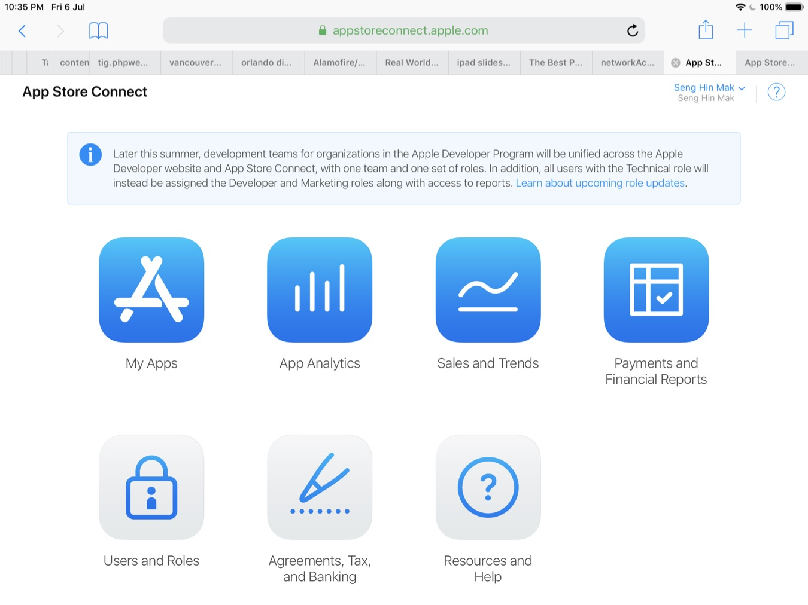


AppStore Connect 分為幾大模塊：

1.  Apps
2.  Analytics
3.  Sales and Trends
4.  Payment
5.  User and roles
6.  Agreement, Tax
7.  Resources Help

# 使用 AlamoFire 取得網絡資源

在 iOS 開發中，我們可以使用 [NSURLSession](https://developer.apple.com/documentation/foundation/nsurlsession)。這是 iOS 7 以後加上的，在此前，我們須使用 NSURLConnection 做更底層的網絡操作。


然而，為了更集中處理高層次設計，我們可以選擇避開太基層的網絡存取 API 應用，而是使用第三方程序庫。在 iOS Swift 中，其中一個常用到的網絡存取資源庫是 [AlamoFire](https://github.com/Alamofire/Alamofire)。


在 AlamoFire 的文件中，有幾項可以幫助我們快速上手：

-   [基本存取](https://github.com/Alamofire/Alamofire/blob/master/Documentation/Usage.md#making-a-request)
-   [確定手機可以連接網絡](https://github.com/Alamofire/Alamofire/blob/master/Documentation/AdvancedUsage.md#network-reachability)
-   [於返回成功才處理數據](https://github.com/Alamofire/Alamofire/blob/master/Documentation/Usage.md#response-validation)

# 範例：載入澳門圖書館列表

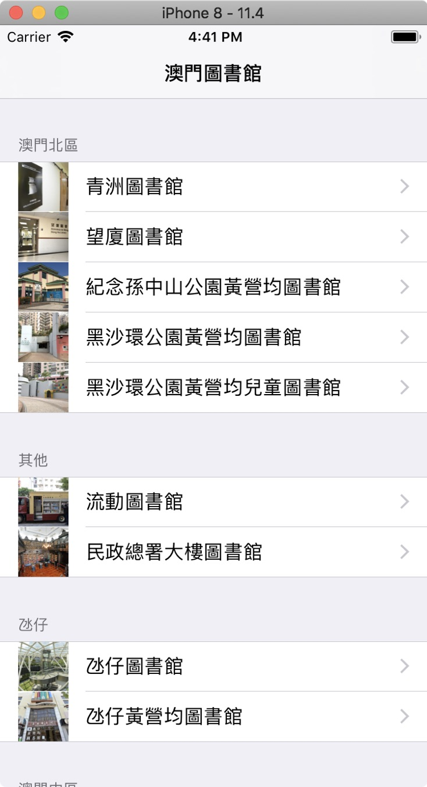


在這個範例中，我們將使用以下 JSON 作為圖書館列表資料的來源。資料來源自[澳門政府圖書館網站](https://www.library.gov.mo/)。


```
https://s3-us-west-2.amazonaws.com/s.cdpn.io/15649/macao-library.json

```


從 AlamoFire 的 Github 中下載整個項目回來後，將檔案放到項目目錄下，接著把 Alamofire.xcodeproj 拖拉進目標 Xcode project。


僅記在 Project 的 Framework 中要加入 Alamofire.framework。


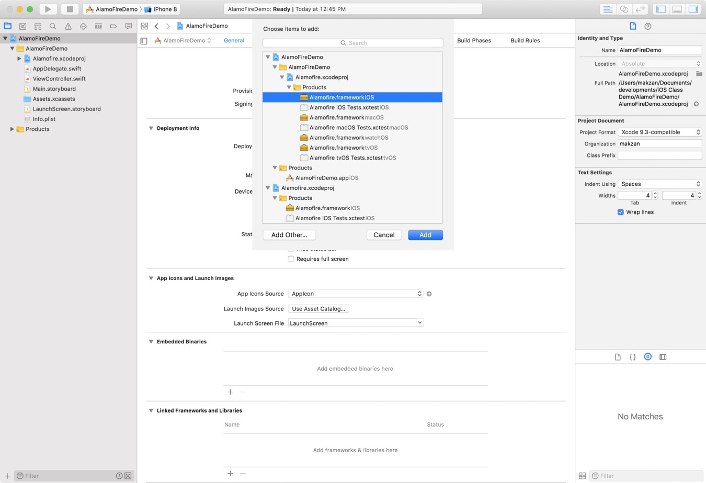


我們會使用自定義的 LibraryListTableViewController 來實現 Table View，在其最頂端，需要匯入 Alamofire 框架，方法是：


```
import Alamofire

```


為了方便稍後載入網絡相片，我們也可以一併匯入 [AlamofireImage](https://github.com/Alamofire/AlamofireImage) 擴展。


接著在 LibraryListTableViewController 中，定義兩個變量：


```
var libraryData:NSDictionary?
var regionNames:NSMutableArray = []

```


然後在 viewDidLoad 中存取目標 JSON:


```
Alamofire.request("https://s3-us-west-2.amazonaws.com/s.cdpn.io/15649/macao-library.json").validate().responseJSON { (response) in
    let json = response.result.value as! NSDictionary

    for (region, _) in json {
        self.regionNames.add(region)
    }
    self.libraryData = json
    self.tableView.reloadData()
}

```


以下是 TableView 的各主要函數代碼。（也可以整個[項目範例下載](http://ios-dev.netlify.com/b5da5dc4a21a4035ce80c63890c5fd5a93b0bf6f/code_examples/AlamoFireDemo.zip)）


```
override func numberOfSections(in tableView: UITableView) -> Int {
    if libraryData != nil {
        return libraryData!.count
    }
    return 0
}

override func tableView(_ tableView: UITableView, numberOfRowsInSection section: Int) -> Int {
    if libraryData != nil {

        let libraries = libraryData![regionNames[section]] as! NSArray
        return libraries.count
    }
    return 0
}

override func tableView(_ tableView: UITableView, titleForHeaderInSection section: Int) -> String? {
    if libraryData != nil {

        return regionNames[section] as? String
    }
    return ""
}


override func tableView(_ tableView: UITableView, cellForRowAt indexPath: IndexPath) -> UITableViewCell {
    let cell = tableView.dequeueReusableCell(withIdentifier: "BasicCell", for: indexPath)

    // Configure the cell...
    let libraries = libraryData![regionNames[indexPath.section]] as! NSArray
    let library:NSDictionary = libraries[indexPath.row] as! NSDictionary

    cell.textLabel?.text = library["name"] as? String
    cell.accessoryType = .disclosureIndicator

    // 若果有使用 AlamofireImage 擴展
    let photoURL = URL(string: library["photo"] as! String)

    cell.imageView?.af_setImage(withURL: photoURL!, filter:AspectScaledToFillSizeFilter(size: CGSize(width: 50, height: 50)), completion: { (_) in
        tableView.reloadRows(at: [indexPath], with: .none)
    })


    return cell
}
```

# 錯誤提示


網絡存取時有發生錯誤的時候，例如當用戶進入升降機時，原本正在送出的網絡請求便有機會超時。這時我們可以向用戶顯示提示，這涉及兩個層次：


1.  給出一個用戶能明白的錯誤文字
2.  決定彈出錯誤的界面方式


其中一個常見的錯誤是存取超時，如果我們直接將錯誤信息跟用戶說，例如 “Error: Request Timeout”，用戶未必會知道發生了什麼事，但如果我們將信息改為：「暫時未能存取網絡，請稍後再試，如問題持續可以聯絡我們」，這樣便會有更好的用戶體驗。


至於界面，我們有幾個選擇：


1.  使用 UIAlert 彈出錯誤提示信息。這是最常見的方式。
2.  自定一個由上向下的錯誤信息橫條 Banner，置於屏幕上方。（或由下向上放於下方）。常用於錯誤不影響用戶繼續操作的情況下
3.  使用覆蓋全畫面的錯誤提示。例如一些錯誤希望用戶提供額外資料

# 載入中提示

在 iOS 系統中，有兩種載入界面可以使用。

1.  [於 Status Bar 上顯示](https://developer.apple.com/documentation/uikit/uiapplication/1623102-networkactivityindicatorvisible)
2.  [使用 UIActivityIndicatorView](https://developer.apple.com/documentation/uikit/uiactivityindicatorview)

Apple 官網也有使用[詳情說明](https://developer.apple.com/design/human-interface-guidelines/ios/controls/progress-indicators/)。

# 教材更新歷史

1.  2018-09-28: 第一節教材推出